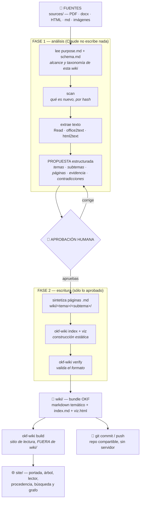

# okf_wiki

**Suelta documentos en una carpeta y deja que Claude los sintetice en una wiki de
conocimiento**: páginas markdown organizadas por tema y subtema, con enlaces cruzados, citas a
las fuentes, un grafo interactivo (`viz.html`) y un sitio estático de lectura con portada,
buscador y procedencia. Sin servidor, sin base de datos, sin MCP: ficheros en disco que viven en
git.

Con un humano en el bucle: **Claude propone la estructura y espera tu aprobación antes de
escribir nada**.

El formato es **Open Knowledge Format v0.2**: cada página declara de dónde sale (`sources`),
quién la escribió y cuándo (`generated`), quién la ha revisado (`verified`) y si sigue vigente
(`status`, `stale_after`).



## Arquitectura

Cinco etapas, y una de ellas es una persona:

| # | Etapa | Qué produce | Quién manda |
|---|---|---|---|
| 1 | **Fuentes** | Documentos crudos en `sources/`, intactos | Tú los sueltas |
| 2 | **Propuesta (HITL)** | Un plan: temas, subtemas, páginas a crear o actualizar, evidencia, contradicciones y preguntas abiertas | Claude propone, **tú apruebas** |
| 3 | **Markdown temático** | Páginas `.md` en `wiki/<tema>/<subtema>/` con frontmatter OKF, citas y enlaces cruzados | Claude redacta lo aprobado |
| 4 | **Construcción estática** | `index.md` en cada nivel y `viz.html`, regenerados desde el markdown | El CLI, sin LLM |
| 5 | **Sitio de lectura** | `site/`: portada, árbol tema/subtema, lector, procedencia y estado, enlaces cruzados, búsqueda y datos de grafo | El CLI, sin LLM |

La etapa 2 es lo que distingue esto de una ingesta automática. Claude **no escribe nada en
`wiki/` hasta que apruebas la propuesta**, y si a mitad de la redacción descubre que hace falta un
tema que no propuso, vuelve a pedirte permiso. La taxonomía es la decisión que más cara sale
corregir después: reorganizar carpetas rompe los enlaces que forman el grafo.

Las etapas 4 y 5 son reproducibles: `index.md`, `viz.html` y `site/` son artefactos derivados.
Se borran y se regeneran con `okf-wiki index`, `okf-wiki viz` y `okf-wiki build`, sin volver a
leer las fuentes ni llamar a ningún modelo.

### Quién hace qué

| Rol | Hace | No hace |
|---|---|---|
| 🧑 **Humano** | Suelta documentos, escribe `purpose.md` y `schema.md`, aprueba o corrige la propuesta, firma `verified` en lo que revisa, commitea | Redactar páginas a mano (puede, pero no es el flujo) |
| 🤖 **LLM** (Claude, vía la skill `okf-ingest`) | Lee las fuentes, propone la taxonomía, redacta las páginas, ata citas, enlaza | Escribir sin aprobación, inventar la fecha, firmarse `verified`, commitear |
| ⚙️ **CLI** (`okf-wiki`) | Lo determinista: fecha UTC real, `scan` por hash, extracción de Office y HTML, índices, `viz.html`, el sitio (`build`, `watch`), validación | Sintetizar, decidir temas, llamar a un modelo, commitear |

La frontera importa: el CLI **no tiene LLM dentro** y el LLM no adivina lo que el CLI puede saber
con certeza. Por eso la fecha sale de `okf-wiki now` y `verified` sólo lo firma una persona.

## Estructura de una wiki

```
mi_wiki/
├── purpose.md              # PARA QUÉ existe esta wiki: objetivo, alcance, fuera de alcance
├── schema.md               # CÓMO se organiza: tabla de temas y subtemas, convenciones
├── sources/                # dropzone: aquí sueltas los documentos (crudo)
├── site/                   # sitio de lectura (autogenerado por `build`, FUERA del bundle)
└── wiki/                   # el bundle OKF
    ├── log.md              # bitácora append-only de cada ingesta
    ├── index.md            # índice (autogenerado) + okf_version: "0.2"
    ├── viz.html            # grafo interactivo (autogenerado, autocontenido)
    ├── ventas/             # TEMA → da el `type` de sus páginas (type: Ventas)
    │   ├── index.md        # autogenerado: lista los subtemas
    │   ├── retencion/      # SUBTEMA → NO cambia el `type`
    │   │   ├── index.md    # autogenerado: lista las páginas
    │   │   └── plan-retencion-2026.md
    │   └── pipeline/
    └── producto/
        └── roadmap/
            └── roadmap-2026.md
```

- **`purpose.md` y `schema.md` van fuera de `wiki/`.** Dentro serían páginas OKF inválidas.
  `purpose.md` dice para qué existe la wiki y, sobre todo, qué queda fuera de alcance: es lo que
  permite descartar material en vez de crear una página por documento. `schema.md` es la tabla de
  temas y subtemas de esta instancia. Ninguno es obligatorio: `okf-wiki context` los reporta como
  `FALTA` sin fallar, pero sin `purpose.md` la propuesta no tiene con qué contrastarse.
- **`site/` también va fuera de `wiki/`.** Es HTML derivado; dentro del bundle contaminaría la
  siguiente pasada de `index` y `viz`.
- **Los `index.md` son artefactos, no contenido.** Los genera `okf-wiki index` en cada nivel.
- **Las carpetas son el árbol de navegación; los enlaces son el grafo.** Cada página vive en una
  sola carpeta y se relaciona con el resto por enlaces markdown relativos, que cruzan temas
  libremente. Esa segunda estructura es la que dibuja `viz.html`.

La organización es **por materia, nunca por tipo de cosa**: no hay `entidades/` ni `conceptos/`.
El campo `type` ya expresa la categoría, y es lo que colorea y filtra el grafo.

Las plantillas de `purpose.md` y `schema.md` que deja `okf-wiki init` llevan una primera línea
marcadora, `<!-- okf-wiki:stub -->`, que borras al rellenarlas. Así el CLI sabe con certeza si
el fichero está listo en vez de pedirle al modelo que lo adivine.

### El formato: OKF v0.2

```yaml
---
type: Ventas                       # el tema de la página (= su carpeta); colorea el grafo
title: "Plan de retención 2026"
description: "Cómo se retiene a las cuentas grandes tras el churn del Q2."
tags: [ventas, retencion]
status: stable                     # draft | stable | deprecated
generated: { by: claude-code/opus-5, at: 2026-08-06T10:12:33Z }   # quién y cuándo escribió
verified: { by: human:ana, at: 2026-08-06T11:00:00Z }             # quién lo ha revisado
stale_after: 2027-01-01            # a partir de aquí, contenido caducado
sources:                           # de qué documentos sale
  - id: informe-q2
    resource: sources/informe-trimestral-q2.pdf
    title: "Informe trimestral Q2 2026"
---

El churn cayó al 3% interanual.[^informe-q2]

[^informe-q2]: informe-trimestral-q2.pdf, p.4
```

Las footnotes se atan por ID (`[^informe-q2]` con `sources[].id`), no por posición: los agentes
reordenan `sources` y un índice numérico atribuiría mal en silencio. `verified` lo firma una
persona, nunca el agente. Los enlaces entre páginas son relativos. El `index.md` raíz declara
`okf_version: "0.2"`.

## Instalación

Requiere [`uv`](https://docs.astral.sh/uv/) y git.

```bash
git clone <este-repo> okf_wiki
cd okf_wiki
bash scripts/setup.sh
```

`setup.sh` crea un venv, instala el motor OKF y este paquete, y enlaza la skill en
`~/.claude/skills/okf-ingest`. El motor no está en PyPI: se instala desde un clon de
[`GoogleCloudPlatform/knowledge-catalog`](https://github.com/GoogleCloudPlatform/knowledge-catalog)
fijado a la revisión

```
3fcbb9f828c2f23d109c855ee403c3a4c81f3a96
```

porque el formato cambió de v0.1 a v0.2 y seguir `main` rompería las wikis existentes sin avisar.
`OKF_REV=<sha>` u `OKF_ENGINE=/ruta` permiten cambiarlo. Tests: `.venv/bin/pytest -q`.

## Uso

```bash
# 1) crea una instancia de wiki
okf-wiki init ~/mis_wikis/mi_wiki --name "Mi Wiki"

# 2) rellena el propósito: para qué es esta wiki y qué queda FUERA de alcance
$EDITOR ~/mis_wikis/mi_wiki/purpose.md     # y borra la línea del marcador `okf-wiki:stub`
okf-wiki context ~/mis_wikis/mi_wiki       # comprueba que dice «Contexto listo»

# 3) suelta documentos en su carpeta sources/
cp ~/Descargas/*.pdf ~/mis_wikis/mi_wiki/sources/

# 4) desde Claude Code, dentro de la carpeta de la wiki:
/okf-ingest

# 5) construye el sitio de lectura y ábrelo (doble clic, sin servidor)
okf-wiki build ~/mis_wikis/mi_wiki --name "Mi Wiki"
open ~/mis_wikis/mi_wiki/site/index.html

# ... o déjalo reconstruyéndose solo mientras editas
okf-wiki watch ~/mis_wikis/mi_wiki
```

En el paso 4 Claude escanea lo nuevo, lo lee y te enseña una propuesta: qué temas y subtemas va
a tocar, qué páginas crea y cuáles actualiza, con qué evidencia, y qué contradice a lo que ya hay.
**No escribe nada hasta que la apruebas.** Cuando das el OK, redacta, regenera `index.md` y
`viz.html`, valida el bundle y te propone el commit.

### El sitio de lectura

La construcción es **explícita y bajo demanda**, sin LLM. `okf-wiki build` produce en
`<instancia>/site/`:

| Pieza | Qué es |
|---|---|
| **Portada** | Nombre, propósito, contadores y listados accionables: borradores, obsoletas, con caducidad, sin `sources`, aisladas |
| **Árbol tema/subtema** | La navegación por carpetas |
| **Lector** | Una página HTML por página del bundle, markdown renderizado con Mermaid y footnotes |
| **Procedencia y estado** | `generated`, `verified`, `status`, `tags` y cada `sources` enlazada al documento real |
| **Enlaces cruzados** | Los `.md` relativos pasan a `.html`, cada página lista sus backlinks, los rotos se marcan en rojo |
| **Búsqueda** | Sobre título, descripción, tags y texto (tecla `/`) |
| **Datos de grafo** | `data/graph.json` y `data/search.json`, para consumir desde fuera |

Tres reglas: la salida vive **FUERA del bundle** y `build` **se niega** a escribir dentro aunque se
lo pidas con `--out`; la salida es reproducible, **Mismo bundle → mismos bytes**, por eso la
caducidad de `stale_after` se evalúa al leer y no al construir; y reconstruir sólo borra lo que
anotó en `.okf-site.json`. `okf-wiki watch` hace lo mismo en bucle cada vez que cambia el
markdown, y su límite es el del proyecto: **no sintetiza, no borra páginas y no commitea**. Si
cambia `sources/`, avisa y para. Detalle en [docs/sitio.md](docs/sitio.md).

### Comandos del CLI

| Comando | Para qué |
|---|---|
| `okf-wiki init <dir> [--name N] [--no-git]` | Crear una wiki nueva con plantillas de contexto |
| `okf-wiki context <instancia> [--json]` | Leer `purpose.md` y `schema.md` y su estado: `ok`, `SIN RELLENAR`, `FALTA` |
| `okf-wiki template <nombre>` | Volcar una plantilla: `purpose`, `schema`, `page`, `proposal` |
| `okf-wiki now [--date\|--json]` | Fecha y hora UTC real para `generated.at` y `log.md` |
| `okf-wiki scan <bundle>` | Qué es nuevo, cambiado o borrado en `sources/` |
| `okf-wiki office2text <file>` | Extraer texto de docx, pptx, xlsx |
| `okf-wiki html2text <file>` | HTML a markdown limpio |
| `okf-wiki index <bundle>` | Regenerar los `index.md` y sellar `okf_version` |
| `okf-wiki viz <bundle> --name N` | Regenerar `viz.html` |
| `okf-wiki build <instancia> [--out D] [--name N] [--force]` | Construir el sitio de lectura en `site/` |
| `okf-wiki watch <instancia> [--interval S]` | Reconstruir el sitio cuando cambie el markdown |
| `okf-wiki verify <bundle> [--strict]` | Validar el formato OKF y avisar de desvíos de v0.2 |
| `okf-wiki commit-state <bundle>` | Reescribir el manifest con el JSON de `scan` |
| `okf-wiki --version` | Versión del paquete y del formato |

`index`, `viz` y `verify` necesitan el motor OKF; el resto funciona sin él. Ningún fallo previsto
sale como traceback: cada familia tiene su código de salida, para que la skill los distinga sin
leer el mensaje.

| Código | Significado | Qué hacer |
|---|---|---|
| `0` | ok | — |
| `1` | el bundle no valida (`verify`, o `--strict` con avisos) | corregir las páginas señaladas |
| `2` | falta el motor OKF | `bash scripts/setup.sh` |
| `3` | ruta inservible: la instancia no existe, falta `sources/`, falta `wiki/` o no tiene páginas, el manifest está corrupto, o `context` ha recibido `wiki/` en vez de la instancia | comprobar la ruta o crear la instancia con `init` |
| `4` | entrada ilegible: fichero no extraíble o fuera de límites, JSON que no es la salida de `scan`, `--out` que no sirve | comprobar el contenido o elegir otra carpeta de salida |

Tres contratos que conviene conocer, con su historia en [docs/contratos-cli.md](docs/contratos-cli.md):

- `verify`, `index` y `viz` **fallan** sobre una ruta sin bundle en vez de tratarla como vacío.
  Antes `verify /ruta/mala` respondía `{"checked": 0, "errors": [], "ok": true}`, y un typo se leía
  como «la wiki está impecable».
- `commit-state` valida el JSON de stdin completo antes de escribir. Un payload equivocado, la salida
  de `now --json` por ejemplo, sale con `4` sin tocar el manifest. Sobre una instancia inexistente
  sale con `3` **sin crear nada**; antes fabricaba `sources/` con un `mkdir -p` y un typo respondía
  «manifest actualizado».
- `verify` avisa de los desvíos de la **taxonomía temática**: un `type` que replica el subtema, una
  carpeta o `type` de entidad/concepto, o un tercer nivel de carpeta. Van como avisos para no
  invalidar bundles ajenos; `--strict` los convierte en fallo.

## Más documentación

- [docs/sitio.md](docs/sitio.md): `build` y `watch` al detalle, y las cuatro reglas del sitio.
- [docs/contratos-cli.md](docs/contratos-cli.md): códigos de salida, límites de los documentos Office, avisos de `verify`.
- [docs/linaje.md](docs/linaje.md): de dónde viene la idea: el LLM Wiki de Karpathy, LLM Wiki con MCP y el Open Knowledge Format de Google.

## Licencia

Código de este proyecto: **MIT** (ver [LICENSE](LICENSE)). Reutiliza el motor OKF
`reference_agent` (Apache-2.0) como dependencia; ver [NOTICE](NOTICE).
