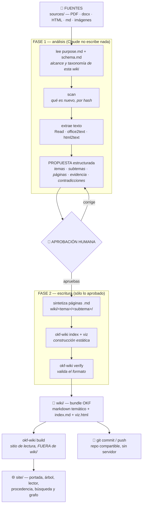

# okf_wiki

**Suelta documentos en una carpeta y deja que Claude los sintetice en una wiki de
conocimiento** — páginas markdown organizadas por tema y subtema, con enlaces cruzados,
citas a las fuentes, un grafo interactivo (`viz.html`) y un **sitio estático de lectura**
con portada, buscador y procedencia (`okf-wiki build`). Sin servidor, sin base de datos,
sin MCP: solo ficheros en disco que viven en git y se comparten como un repo.

Con un humano en el bucle: **Claude propone la estructura y espera tu aprobación antes de
escribir nada**.

El formato es **Open Knowledge Format v0.2**: cada página declara de dónde sale
(`sources`), quién la escribió y cuándo (`generated`), quién la ha revisado (`verified`) y
si sigue vigente (`status`, `stale_after`).



## Arquitectura

Cuatro etapas, y una de ellas es una persona:

| # | Etapa | Qué produce | Quién manda |
|---|---|---|---|
| 1 | **Fuentes** | Documentos crudos en `sources/`, intactos | Tú los sueltas |
| 2 | **Propuesta (HITL)** | Un plan estructurado: temas, subtemas, páginas a crear/actualizar, evidencia, contradicciones y preguntas abiertas | Claude propone, **tú apruebas** |
| 3 | **Markdown temático** | Páginas `.md` en `wiki/<tema>/<subtema>/` con frontmatter OKF, citas y enlaces cruzados | Claude redacta lo aprobado |
| 4 | **Construcción estática** | `index.md` en cada nivel + `viz.html`, regenerados desde el markdown | El CLI, sin LLM |
| 5 | **Sitio de lectura** | `site/` — portada, árbol tema/subtema, lector, procedencia y estado, enlaces cruzados, búsqueda y datos de grafo | El CLI (`build`/`watch`), sin LLM |

La etapa 2 es lo que distingue esto de un pipeline de ingesta automático. Claude **no
escribe nada en `wiki/` hasta que apruebas la propuesta**, y si a mitad de la redacción
descubre que hace falta un tema que no propuso, vuelve a pedirte permiso en lugar de
inventárselo. Es deliberado: la taxonomía es la decisión que más cara sale corregir
después, porque reorganizar carpetas rompe todos los enlaces relativos que forman el grafo.

Las etapas 4 y 5 son **reproducibles**: `index.md`, `viz.html` y todo `site/` son
artefactos derivados. Se pueden borrar y regenerar desde las páginas con `okf-wiki index`,
`okf-wiki viz` y `okf-wiki build`, sin volver a leer las fuentes ni a llamar a ningún
modelo.

### Quién hace qué

| Rol | Hace | **No** hace |
|---|---|---|
| 🧑 **Humano** | Suelta documentos, escribe `purpose.md`/`schema.md`, aprueba o corrige la propuesta, firma `verified` en las páginas que revisa, commitea | Redactar páginas a mano (puede, pero no es el flujo) |
| 🤖 **LLM** (Claude, vía la skill `okf-ingest`) | Lee las fuentes, propone la taxonomía, redacta las páginas, ata citas, enlaza | Escribir sin aprobación, inventar la fecha, firmarse `verified`, commitear |
| ⚙️ **CLI** (`okf-wiki`) | Todo lo determinista: fecha UTC real, `scan` por hash, extracción de Office/HTML, índices, `viz.html`, el sitio de lectura (`build`/`watch`), validación, manifest | Sintetizar, decidir temas, llamar a ningún modelo, commitear |

La frontera importa: el CLI **no tiene LLM dentro** y el LLM **no adivina lo que el CLI
puede saber con certeza**. Por eso la fecha sale de `okf-wiki now` y no de la memoria del
modelo, y por eso `verified` sólo lo firma una persona.

### Construcción: `build` y `watch`

La construcción es **explícita y bajo demanda**. Son tres comandos, todos sin LLM y todos
regenerables desde el markdown:

```bash
okf-wiki index <instancia>    # los index.md de cada nivel, dentro del bundle
okf-wiki viz   <instancia>    # viz.html, el grafo interactivo, dentro del bundle
okf-wiki build <instancia>    # site/ — el sitio de lectura, FUERA del bundle
okf-wiki watch <instancia>    # lo anterior, cada vez que cambie el markdown
```

`index` y `viz` los lanza la skill al final de cada ingesta (pasos 7 y 9), así que en el
flujo normal no hay que acordarse de nada. `build` es el que convierte el bundle en algo
que se lee cómodamente.

**Qué produce `okf-wiki build`** en `<instancia>/site/` (una sola pasada, sin servidor):

| Pieza | Qué es |
|---|---|
| **Portada** (`index.html`) | Nombre de la wiki, el propósito de `purpose.md`, contadores, y los listados accionables: borradores, obsoletas, con caducidad, sin `sources` y aisladas en el grafo |
| **Árbol tema/subtema** | La navegación por carpetas: cada tema con el `type` que comparten sus páginas —o el nombre de la carpeta si no todas declaran el mismo, incluido el caso de una página sin `type`— sus subtemas y sus páginas con descripción |
| **Lector** | Una página HTML por página del bundle: markdown renderizado (tablas, listas, código, Mermaid, footnotes) con el título y la descripción del frontmatter |
| **Procedencia y estado** | Panel lateral con `generated`, `verified`, `status`, `tags`, el fichero de origen y cada entrada de `sources` enlazada al documento real de `sources/` |
| **Enlaces cruzados** | Los `.md` relativos se reescriben a `.html`, **cada página lista quién la enlaza** (backlinks), y los enlaces rotos se marcan en rojo en vez de desaparecer |
| **Búsqueda** | Buscador en la cabecera de todas las páginas (tecla `/`), sobre título, descripción, tags y texto |
| **Datos de grafo** | `data/graph.json` (nodos y aristas, con los mismos `id` que `viz.html`) y `data/search.json`, para consumirlos desde fuera |

Cuatro reglas que definen el comando:

1. **La salida vive fuera del bundle.** El sitio es un artefacto derivado: dentro de
   `wiki/` lo recorrería el motor OKF en la siguiente pasada y los índices y el grafo
   acabarían describiendo su propio HTML. `build` **se niega** a escribir dentro del
   bundle, aunque se lo pidas con `--out`. Por defecto escribe en `<instancia>/site/`,
   hermana de `wiki/`. Y como la entrada es la **instancia** —de ahí salen el propósito de
   la portada y los enlaces a `sources/`, que viven fuera del bundle—, pasarle `wiki/` sale
   con **exit 3** y te dice que lo repitas un nivel más arriba, en vez de construir un
   sitio sin propósito y con las fuentes apuntando a rutas que no existen. Un bundle
   **plano** (una carpeta de páginas sin `wiki/` dentro) sigue valiendo: en ese caso hay
   que darle un `--out` fuera de esa carpeta.
2. **La salida es reproducible.** Mismo bundle → mismos bytes: no hay fecha de
   construcción ni rutas absolutas en el HTML. Dos `build` seguidos no producen ningún
   cambio en git, así que el sitio se puede versionar sin ruido (o ignorar, si prefieres).
   Por eso la caducidad de `stale_after` se evalúa **al leer**, en el navegador, y no al
   construir: si se calculase aquí, una página caducaría sin que nadie reconstruyese nada.
3. **Reconstruir limpia lo que sobra, y sólo eso.** `build` anota lo que escribió en
   `<out>/.okf-site.json` y en la pasada siguiente borra de ahí las páginas que ya no
   existen. Una carpeta de salida con contenido ajeno se **rechaza** en vez de vaciarse
   (`--force` la adopta). Ese manifest es un fichero como otro cualquiera, así que sus
   entradas se validan antes de borrar: nada que se salga de `--out` —rutas absolutas, `..`
   en cualquier tramo, enlaces simbólicos— se sigue ni se borra, y `build` avisa de lo que
   ha rechazado para que puedas mirar el fichero.
4. **No necesita el motor OKF.** `build` y `watch` leen el markdown con `pyyaml` y lo
   renderizan con un renderizador propio. Un problema instalando el motor te puede dejar
   sin `viz.html`, pero no sin poder leer tu propia wiki.

**`okf-wiki watch`** hace lo mismo en bucle: construye una vez y reconstruye cada vez que
cambia el markdown del bundle (sondea por hash cada `--interval` segundos, 2 por defecto).
Su límite es el contrato del proyecto, no una limitación técnica: **no sintetiza, no borra
páginas y no commitea**. Si lo que cambia es la dropzone `sources/`, lo dice y para ahí:

```
sources/ ha cambiado (nuevo: informe-q3.pdf). Ejecuta `/okf-ingest` para
sintetizarlo: watch no ingiere, porque la propuesta la tiene que aprobar una persona.
```

No hay servidor de desarrollo y no hace falta: tanto `site/index.html` como `viz.html` se
abren con doble clic desde el sistema de ficheros, sin `http://` y sin instalar nada. El
lector se lee entero sin JavaScript; el JS sólo añade la búsqueda, el filtro del árbol y el
distintivo de caducidad.

## De dónde viene esto (linaje)

`okf_wiki` es la **mezcla** de tres ideas, tomando lo mejor de cada una:

1. **[El "LLM Wiki" de Andrej Karpathy](https://gist.github.com/karpathy/442a6bf555914893e9891c11519de94f)**
   — el gist que popularizó la idea: en vez de re-derivar respuestas de los documentos en
   cada consulta (RAG), un LLM **compila** las fuentes una vez en una wiki markdown
   persistente e interconectada, y luego consulta la wiki. `raw/` + `wiki/` + `index.md`.

2. **[LLM Wiki (implementación con MCP)](https://github.com/lucasastorian/llmwiki)** — llevó
   el patrón a una app: servidor + base de datos + MCP donde subes documentos y Claude
   escribe la wiki. De aquí viene la **ergonomía "soltar documentos → sintetizar"** y la
   idea de una *receta* en prosa (el prompt-guía) que enseña al LLM a redactar buenas
   páginas. (Dato clave: la app **no** sintetiza sola; la síntesis siempre la hace un
   agente externo como Claude.)

3. **[Open Knowledge Format (OKF), de Google](https://github.com/GoogleCloudPlatform/knowledge-catalog)**
   ([blog](https://cloud.google.com/blog/products/data-analytics/how-the-open-knowledge-format-can-improve-data-sharing))
   — formalizó el patrón en un **formato abierto**: un bundle es una carpeta de `.md` con
   frontmatter YAML, portable, versionable y consumible por cualquier herramienta. Trae un
   **visor** (`viz.html`) que dibuja el grafo de conceptos. Su **v0.2** añade lo que hace
   falta cuando el corpus lo escribe un agente: procedencia, confianza y caducidad como
   campos del frontmatter.

**`okf_wiki` = la ergonomía de (2) + el formato y el visor de (3), con Claude como motor
(1), y sin servidor/MCP/BD.** Tú sueltas ficheros; Claude los lee (PDFs e imágenes de
forma nativa), sintetiza páginas OKF por tema con enlaces y citas, y regenera el grafo.
Todo son ficheros: lo subes a un repo git y cualquiera lo consume sin instalar nada.

## Cómo funciona

- **Una skill de Claude Code** (`okf-ingest`) contiene la *receta* de síntesis (adaptada de
  la guía de LLM Wiki a las reglas de OKF v0.2: estructura por tema y subtema, `type`
  ligero, enlaces relativos, procedencia con `sources` + footnotes por ID, elementos
  visuales) y el protocolo de dos fases con aprobación humana en medio.
- **Dos ficheros de contexto por wiki** (`purpose.md` y `schema.md`, en la raíz de la
  instancia) que le dicen a la skill *para qué* existe esa wiki y *cómo* se organiza. Sin
  ellos la skill sabe redactar páginas OKF correctas, pero no sabe cuáles merecen existir.
- **Un CLI `okf-wiki`** hace lo determinista (sin LLM): dar la fecha UTC real, detectar qué
  es nuevo en `sources/` (por hash, ingesta incremental), extraer texto de Office y HTML,
  regenerar índices y `viz.html`, y validar el formato.
- **El motor OKF** (`reference_agent` de Google, Apache-2.0) se reutiliza para el visor, los
  índices y la (de)serialización de documentos. Está **fijado a una revisión concreta**
  (ver [Instalación](#instalación)): `main` se mueve y el formato ha cambiado de v0.1 a v0.2.

### El formato: OKF v0.2

Cada página lleva frontmatter YAML. Lo que v0.2 añade sobre "markdown con metadatos" es
que la **procedencia**, la **confianza** y el **ciclo de vida** son campos de primera clase:

```yaml
---
type: Ventas                       # el tema de la página (= su carpeta); colorea el grafo
title: "Plan de retención 2026"
description: "Cómo se retiene a las cuentas grandes tras el churn del Q2."
tags: [ventas, retencion]
status: stable                     # draft | stable | deprecated
generated: { by: claude-code/opus-5, at: 2026-08-06T10:12:33Z }   # quién y cuándo escribió
verified: { by: human:ana, at: 2026-08-06T11:00:00Z }             # quién lo ha revisado
stale_after: 2027-01-01            # a partir de aquí, contenido caducado
sources:                           # de qué documentos sale
  - id: informe-q2
    resource: sources/informe-trimestral-q2.pdf
    title: "Informe trimestral Q2 2026"
---

El churn cayó al 3% interanual.[^informe-q2]

[^informe-q2]: informe-trimestral-q2.pdf, p.4
```

Detalles que importan:

- **`generated: { by, at }` sustituye al `timestamp` de v0.1**, y la lista `# Citations`
  del cuerpo la sustituye `sources`. `okf-wiki verify` avisa (sin fallar) de las páginas
  que sigan en la forma vieja: un bundle v0.1 se sigue leyendo.
- **Las footnotes se atan por ID** (`[^informe-q2]` ↔ `sources[].id`), no por posición: los
  agentes reordenan `sources` constantemente y un índice numérico atribuiría mal en silencio.
- **`verified` lo firma una persona**, no el agente; de ahí sale el nivel de confianza que
  muestra el visor (sin verificar / verificado por máquina / revisado por humano).
- **Los enlaces entre páginas son relativos** (`../ventas/plan.md`). OKF v0.2 también
  permite rutas absolutas desde la raíz del bundle, pero el visor de este repo solo sigue
  las relativas: con una absoluta la página queda sin arista en el grafo.
- **El `index.md` raíz declara `okf_version: "0.2"`** — el único sitio donde el formato
  admite frontmatter en un índice. Lo pone `okf-wiki index` en cada regeneración.

### Estructura de una wiki

```
mi_wiki/
├── purpose.md              # PARA QUÉ existe esta wiki: objetivo, alcance, fuera de alcance
├── schema.md               # CÓMO se organiza: tabla de temas y subtemas, convenciones
├── sources/                # dropzone: aquí sueltas los documentos (crudo)
├── site/                   # sitio de lectura (autogenerado por `build`, FUERA del bundle)
└── wiki/                   # el bundle OKF
    ├── log.md              # bitácora append-only de cada ingesta
    ├── index.md            # índice (autogenerado) + okf_version: "0.2"
    ├── viz.html            # grafo interactivo (autogenerado, autocontenido)
    ├── ventas/             # TEMA → da el `type` de sus páginas (type: Ventas)
    │   ├── index.md        # autogenerado: lista los subtemas
    │   ├── retencion/      # SUBTEMA → NO cambia el `type`
    │   │   ├── index.md    # autogenerado: lista las páginas
    │   │   └── plan-retencion-2026.md
    │   └── pipeline/
    └── producto/
        └── roadmap/
            └── roadmap-2026.md
```

Cuatro cosas que no se ven en el árbol:

- **`purpose.md` y `schema.md` van en la raíz, fuera de `wiki/`.** Dentro serían páginas
  OKF inválidas —no tienen frontmatter— y romperían `verify`. Fuera, ni los índices ni el
  grafo los ven: `verify` sólo cuenta las páginas del bundle.
- **`site/` también va fuera de `wiki/`, y por el mismo motivo.** Es HTML derivado: dentro
  del bundle contaminaría la siguiente pasada de `index` y `viz`. Se borra y se regenera
  con `okf-wiki build`; no se edita a mano.
- **Los `index.md` son artefactos, no contenido.** Los genera `okf-wiki index` en cada
  nivel (raíz, tema y subtema): el de un tema lista sus subtemas, el de un subtema lista
  sus páginas. No se editan a mano.
- **Las carpetas son el árbol de navegación; los enlaces son el grafo.** Cada página vive
  en una sola carpeta y se relaciona con el resto mediante enlaces markdown relativos
  (`../../producto/roadmap/roadmap-2026.md`), que cruzan temas y subtemas libremente. Esa
  segunda estructura, transversal a las carpetas, es la que dibuja `viz.html`. Nada se
  duplica en dos carpetas para expresar que pertenece a ambas: para eso está el enlace.

La organización es **por materia, nunca por tipo de cosa**: no hay `entidades/` ni
`conceptos/`. El campo `type` del frontmatter ya expresa la categoría, y es lo que colorea
y filtra el grafo; partir una misma materia entre dos carpetas la rompería en dos silos.

`okf-wiki init` crea esa estructura —incluidas las plantillas de `purpose.md` y
`schema.md`, sólo si no existen ya— y, si la carpeta no está dentro de un repo, inicializa
git ahí mismo (sin commitear). Si ya lo está, no anida un repo dentro de otro: la wiki vive
en el repo que la contiene.

### El contexto: `purpose.md` y `schema.md`

Son el ancla de dominio de la propuesta, y **lo que más sube la calidad de la síntesis por
minuto invertido**. `okf-wiki init` deja una plantilla de cada uno con una primera línea
marcadora:

```
<!-- okf-wiki:stub — Rellena este fichero y borra esta línea. -->
```

Borras esa línea al rellenarlo, y así el CLI sabe con certeza si el fichero está listo
(`okf-wiki context` lo reporta como `ok`, `SIN RELLENAR (plantilla)` o `FALTA`) en lugar de
pedirle al modelo que juzgue si un texto "parece" una plantilla.

- **`purpose.md`** — objetivo, preguntas que la wiki debe saber responder, alcance,
  **fuera de alcance** y audiencia. La sección de *fuera de alcance* es la que más trabaja:
  es lo que permite a la skill descartar material en vez de crear páginas por inercia.
- **`schema.md`** — la tabla de temas y subtemas de *esta* instancia, sus convenciones de
  nombrado y sus tags habituales. Existe porque la skill es global —la comparten todas tus
  wikis— y cada wiki necesita su propia taxonomía sin tener que modificarla para todas.
  La tabla es tuya, pero la plantilla repite las cuatro prohibiciones que **no** dependen de
  la instancia (nada de entidades/conceptos, el `type` lo fija el tema, dos niveles como
  máximo, una página en una sola carpeta): son las que comprueba `okf-wiki verify`.

Ninguno de los dos es obligatorio: una wiki creada antes de que existieran sigue
funcionando, y `okf-wiki context` los reporta como `FALTA` sin fallar. Pero si `purpose.md`
está vacío, la skill avisa antes de escanear de que los temas que proponga no tendrán con
qué contrastarse.

`okf-wiki context` recibe la **instancia** (la carpeta que contiene el contexto, `sources/`
y `wiki/`), no el bundle. Una ruta que no existe, un fichero, o el propio `wiki/` salen con
código 3 y un mensaje con la ruta correcta, en vez de reportar el contexto como `FALTA`:
ese `FALTA` significa «esta wiki no tiene contexto», y una ruta equivocada que lo imitase
dejaría a la ingesta creyendo que no hay nada contra lo que contrastar los temas.

## Instalación

Requiere [`uv`](https://docs.astral.sh/uv/) y git.

```bash
git clone <este-repo> okf_wiki
cd okf_wiki
bash scripts/setup.sh
```

`setup.sh` crea un venv (Python 3.13), instala el motor OKF y este paquete (con los extras
de test), y enlaza la skill en `~/.claude/skills/okf-ingest`.

### Revisión fijada del motor OKF

El motor no está en PyPI: se instala desde un clon de
[`GoogleCloudPlatform/knowledge-catalog`](https://github.com/GoogleCloudPlatform/knowledge-catalog)
que `setup.sh` deja en la revisión

```
3fcbb9f828c2f23d109c855ee403c3a4c81f3a96
```

que es la serie "migrate format and tooling to Open Knowledge Format v0.2" (#227) más la
actualización del `SPEC.md` a v0.2 — el último commit de esa serie que toca `okf/`. El pin
es un SHA y no `main` porque el formato cambió de v0.1 a v0.2 (`timestamp` → `generated`,
citas → `sources`) y este repo asume v0.2; seguir `main` rompería las wikis existentes sin
avisar. `setup.sh` clona si hace falta, hace `checkout --detach` a ese SHA y aborta si el
clon tiene cambios locales sin guardar.

Escapes:

```bash
OKF_REV=<sha> bash scripts/setup.sh              # probar otra revisión
OKF_ENGINE=/ruta/knowledge-catalog/okf bash scripts/setup.sh   # usar tu clon tal cual
```

### Tests

```bash
.venv/bin/python -m pytest
```

Las pruebas de integración se saltan solas si el motor OKF no está instalado.

## Uso

```bash
# 1) crea una instancia de wiki
okf-wiki init ~/mis_wikis/mi_wiki --name "Mi Wiki"

# 2) rellena el propósito: para qué es esta wiki y qué queda FUERA de alcance
$EDITOR ~/mis_wikis/mi_wiki/purpose.md     # y borra la línea del marcador `okf-wiki:stub`
okf-wiki context ~/mis_wikis/mi_wiki       # comprueba que dice «Contexto listo»

# 3) suelta documentos en su carpeta sources/
cp ~/Descargas/*.pdf ~/mis_wikis/mi_wiki/sources/

# 4) desde Claude Code, dentro de la carpeta de la wiki:
/okf-ingest

# 5) construye el sitio de lectura y ábrelo (doble clic, sin servidor)
okf-wiki build ~/mis_wikis/mi_wiki --name "Mi Wiki"
open ~/mis_wikis/mi_wiki/site/index.html

# ... o déjalo reconstruyéndose solo mientras editas
okf-wiki watch ~/mis_wikis/mi_wiki
```

El paso 2 se puede saltar —la ingesta funciona igual— pero es el que decide si la wiki
acaba organizada o siendo un vertedero de resúmenes: es lo que le permite a Claude
descartar material en vez de escribir una página por cada documento.

En el paso 4 Claude escanea lo nuevo, lo lee y **te enseña una propuesta**: qué temas y
subtemas va a tocar, qué páginas crea y cuáles actualiza, con qué evidencia, y qué
contradice a lo que ya hay escrito. **No escribe nada hasta que la apruebas.** Cuando das
el OK, redacta las páginas, regenera `index.md` y `viz.html`, valida el bundle y te propone
el commit. Abre `viz.html` con doble clic para ver el grafo, y `site/index.html` (paso 5)
para leer la wiki con portada, buscador y procedencia.

### Comandos del CLI

| Comando | Para qué |
|---|---|
| `okf-wiki init <dir> [--name N] [--no-git]` | Crear una wiki nueva (con git y plantillas de contexto, si es seguro) |
| `okf-wiki context <instancia> [--json]` | Leer `purpose.md`/`schema.md` y su estado (`ok`/`SIN RELLENAR`/`FALTA`) |
| `okf-wiki template <nombre>` | Volcar una plantilla a stdout: `purpose`, `schema`, `page`, `proposal` |
| `okf-wiki now [--date\|--json]` | Fecha/hora UTC real para `generated.at` y `log.md` |
| `okf-wiki scan <bundle>` | Ver qué es nuevo/cambiado/borrado en `sources/` |
| `okf-wiki office2text <file>` | Extraer texto de docx/pptx/xlsx |
| `okf-wiki html2text <file>` | Convertir HTML a markdown limpio |
| `okf-wiki index <bundle>` | Regenerar los `index.md` y sellar `okf_version` |
| `okf-wiki viz <bundle> --name N` | Regenerar `viz.html` |
| `okf-wiki build <instancia> [--out D] [--name N] [--force] [--json]` | Construir el sitio de lectura en `<instancia>/site/` (fuera del bundle) |
| `okf-wiki watch <instancia> [--interval S] [--cycles N]` | Reconstruir el sitio cada vez que cambie el markdown (no sintetiza ni commitea) |
| `okf-wiki verify <bundle> [--strict]` | Validar el formato OKF + avisos de conformidad v0.2 |
| `okf-wiki commit-state <bundle>` | Reescribir el manifest (JSON de `scan` por stdin) |
| `okf-wiki --version` | Versión del paquete y del formato que produce |

`index`, `viz` y `verify` necesitan el motor OKF; el resto —`build` y `watch` incluidos—
funciona sin él. Si falta, el comando falla con instrucciones concretas (código de salida
2) en lugar de un `ImportError`.

Ningún fallo previsto sale como traceback: cada familia tiene su propio código de salida,
para que la skill pueda distinguirlos sin leer el mensaje.

| Código | Significado | Qué hacer |
|---|---|---|
| `0` | ok | — |
| `1` | el bundle no valida (`verify`, o `--strict` con avisos) | corregir las páginas señaladas |
| `2` | falta el motor OKF (`reference_agent`) | `bash scripts/setup.sh` |
| `3` | ruta de trabajo inservible: la instancia no existe o es un fichero, falta `sources/`, falta `wiki/` (o no tiene páginas), el manifest está corrupto, `context` ha recibido el bundle `wiki/` en vez de la instancia, o la dropzone tiene fuentes que `scan` no puede afirmar contenidas en `sources/` (enlaces que salen, circulares, rotos o a rutas ocultas, y enlaces duros) | comprobar la ruta, crear la instancia con `init`, reparar/borrar `sources/.ingest-state.json`, o copiar el documento a `sources/` en vez de enlazarlo |
| `4` | entrada ilegible: fichero no extraíble (contenido que no corresponde a la extensión, o un Office que se pasa de los [límites de abajo](#límites-de-los-documentos-office)), JSON de stdin que no es la salida de `scan`, o un `--out` que no sirve (un directorio inexistente en `viz`; una carpeta dentro del bundle o con contenido ajeno en `build`/`watch`) | comprobar que el contenido corresponde a la extensión, repasar la tubería `scan \| commit-state`, o elegir otra carpeta de salida |

El código `3` existe para que un error de ruta **no** se lea como «nada nuevo que
ingerir», y para que un manifest corrupto no dispare una reingesta completa que
duplicaría conceptos. Por el mismo motivo `scan` sale con `3` —sin imprimir JSON— cuando
la dropzone contiene algo que no puede afirmar contenido en `sources/`: un enlace que
apunta fuera (o a una ruta oculta, o roto, o circular) y un enlace duro, que es el mismo
agujero sin destino que enseñar. Todo lo que `scan` lee tiene que estar dentro de
`sources/` **y alcanzarse por un camino sin enlaces**; lo que no, se rechaza con un
mensaje en vez de omitirse de un JSON que se leería como una dropzone en orden. Por eso `verify`, `index` y `viz` **fallan** sobre una ruta que no
contiene un bundle en vez de tratarla como un bundle vacío: antes `verify /ruta/mala`
respondía `{"checked": 0, "errors": [], "ok": true}` con salida `0`, así que un typo se
leía como «la wiki está impecable».

#### Límites de los documentos Office

Un docx/pptx/xlsx es un zip de XML, y `office2text` lo carga en memoria para recorrerlo.
Eso deja varias maneras de que un fichero de unos KB se lleve la memoria de la máquina, y
cada una tiene su tope; pasarse es una entrada inservible (**exit 4**), no un fallo de la
instancia:

| Límite | Valor | Qué corta |
|---|---|---|
| Métodos de compresión admitidos | `STORED`, `DEFLATE` | el miembro en BZIP2 o LZMA. Es lo único que escriben Word, Excel, PowerPoint y LibreOffice, y los demás métodos no tienen el techo de expansión de DEFLATE: en BZIP2, el límite de la fila siguiente cabe en unos **cientos de bytes** de zip, por debajo de todos los límites de tamaño |
| Bytes sin comprimir por miembro del zip | 128 MB | el `word/document.xml` que declara gigabytes (*zip bomb*) |
| Bytes sin comprimir por documento | 256 MB | el pptx de mil slides o el xlsx de mil hojas, que miembro a miembro no se pasan pero sumando sí |
| Factor de expansión de un miembro | ×200 | la amplificación que sólo tiene sentido como ataque (el XML de OOXML comprime ×3–×10). Sólo se mira a partir de 4 KB comprimidos: por debajo el ratio es ruido, y con DEFLATE —que no pasa de ×1032— esos 4 KB no dan ni para 4,2 MB |
| Columnas de una hoja `xlsx` | 16.384 (`XFD`) | la referencia de celda que se sale de la hoja (`r="AAAA…1"`), que obligaría a reservar todos los huecos hasta esa columna |
| Celdas materializadas por `xlsx` | 4.000.000 | miles de filas con una celda en la última columna: cada fila se rellena hasta la suya, y el producto crece sin que el tamaño del XML lo delate |

Los cuatro primeros se comprueban **en la cabecera del zip**, así que el miembro
desproporcionado se rechaza sin descomprimirlo (y la lectura real va acotada igual, porque
la cabecera la escribe quien genera el fichero). Cuando el que corta es el presupuesto del
documento, el mensaje lo dice —cuánto queda y de cuánto— en vez de anunciar como «máximo»
un número que no es ninguna de las dos constantes. Los dos de la hoja de cálculo se
comprueban **mientras se recorre**, antes de reservar cada fila: el coste que vigilan no
está en el XML que se lee, sino en las celdas **vacías** que hay que materializar para
dejar cada valor en su columna — un xlsx de 263 bytes con una sola celda en `ZZZZZ1`
producía 37 MB de texto y 321 MB de memoria, y con la referencia un poco más larga no
terminaba nunca.

Son límites de cordura, y los valores viven en `helpers.MAX_OFFICE_*` y
`helpers.MAX_XLSX_*` por si una instancia necesita otros. El único que un documento
real roza es el de bytes por miembro, y por eso está en 128 MB y no en los 64 MB de
antes: un xlsx legítimo con un `sheet1.xml` de unos 105 MB y un ratio de compresión
corriente —una hoja de cálculo de unos cientos de miles de filas pasa de los 100 MB
de XML sin nada raro dentro— salía por **exit 4** como si fuese una bomba, mandando
a trocear a mano un xlsx que el código sabe leer. Subirlo no ensancha nada: en el
tramo nuevo (64–128 MB) el que ata es el factor de expansión —una bomba que declara
100 MB desde unos KB multiplica por miles, no por ×200— y el presupuesto del
documento entero sigue en 256 MB.

Con **exit 4** salen también los dos zips que `zipfile` no rechaza sino que **avisa**, y
que por tanto se colaban: dos entradas del directorio central sobre la misma cabecera local
(«possible zip bomb») y el campo extra Unicode (`0x7075`) con el nombre vacío. Un aviso no
sirve aquí por dos motivos. El texto lo redacta el fichero —el del solape interpola el
nombre del miembro, y ese campo admite 65.535 bytes—, así que un `.pptx` de 120 KB escribía
60 KB por stderr y el comando salía con `0` como si el documento estuviese bien. Y qué
ocurre con el aviso no lo decide este código: con `PYTHONWARNINGS=error` o `-W error`
—habitual en CI— escapaba como `UserWarning`, con traceback y exit `1`, que para la skill
no es «documento que no sirve» sino «el CLI se ha caído». Ahora los dos son
`OfficeStructureError`, con el nombre del miembro y el texto del aviso citados acotados: el
mismo contrato que el resto de los rechazos, y el mismo independientemente de cómo esté
configurado Python.

`commit-state` valida el JSON de stdin **completo antes de escribir**: exige las listas de
`scan` con el `path` y el `sha256` de cada fuente, así que un payload equivocado —la salida
de `now --json`, por ejemplo— sale con `4` sin tocar el manifest, en vez de anunciar
«manifest actualizado» sin haber marcado nada. Y comprueba la ruta con el mismo criterio
que `scan`: sobre una instancia que no existe, un fichero, o una carpeta sin `sources/`
sale con `3` **sin crear nada**. Antes fabricaba `<ruta>/sources/.ingest-state.json` con
un `mkdir -p`, así que un typo respondía «manifest actualizado» y dejaba la ruta inventada
lo bastante formada como para que el `scan` siguiente también pasase —devolviendo las
fuentes reales como `deleted`— mientras el manifest de verdad seguía sin marcarse.

`verify` devuelve JSON con `errors` (rompen el formato → exit 1) y `warnings` (desvíos de
v0.2: frontmatter v0.1, footnotes sin `sources[].id`, enlaces que el visor ignora…). Los
avisos no fallan por defecto para que un bundle v0.1 siga siendo válido; `--strict` los
convierte en fallo.

Los `warnings` incluyen también los desvíos de la **taxonomía temática**, con la ruta del
fichero y la evidencia:

| Aviso | Qué señala |
|---|---|
| `type` que replica el subtema | `ventas/retencion/plan.md` con `type: Retencion`: el `type` lo fija el tema de primer nivel (`type: Ventas`), y un `type` por subtema fragmenta la leyenda del grafo |
| carpeta o `type` de entidad/concepto | `conceptos/`, `entidades/`, `personas/`, `definiciones/`, `type: Concepto`, `type: Entidad`: la wiki se organiza por materia, y esas relaciones son enlaces |
| profundidad mayor que tema/subtema | un tercer nivel de carpeta: el "tema" eran dos temas |

Van por el canal de avisos **a propósito**: OKF es deliberadamente permisivo con la
estructura del bundle, así que ninguno de los tres invalida un bundle ajeno con otra
taxonomía. Es `--strict` —la comprobación final de la ingesta— quien los convierte en fallo.
Son las mismas reglas que la plantilla de `schema.md` deja escritas en cada instancia.

## Licencia

Código de este proyecto: **MIT** (ver [LICENSE](LICENSE)). Reutiliza el motor OKF
`reference_agent` (Apache-2.0) como dependencia; ver [NOTICE](NOTICE).
