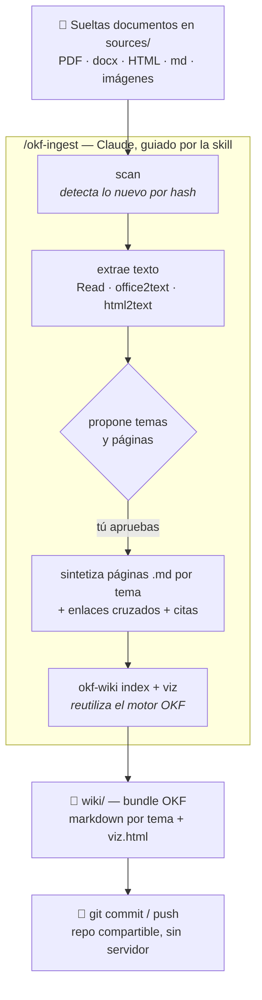

# okf_wiki

**Suelta documentos en una carpeta y deja que Claude los sintetice en una wiki de
conocimiento** — páginas markdown organizadas por tema, con enlaces cruzados, citas a las
fuentes y un grafo interactivo (`viz.html`). Sin servidor, sin base de datos, sin MCP:
solo ficheros en disco que viven en git y se comparten como un repo.



## De dónde viene esto (linaje)

`okf_wiki` es la **mezcla** de tres ideas, tomando lo mejor de cada una:

1. **[El "LLM Wiki" de Andrej Karpathy](https://gist.github.com/karpathy/442a6bf555914893e9891c11519de94f)**
   — el gist que popularizó la idea: en vez de re-derivar respuestas de los documentos en
   cada consulta (RAG), un LLM **compila** las fuentes una vez en una wiki markdown
   persistente e interconectada, y luego consulta la wiki. `raw/` + `wiki/` + `index.md`.

2. **[LLM Wiki (implementación con MCP)](https://github.com/lucasastorian/llmwiki)** — llevó
   el patrón a una app: servidor + base de datos + MCP donde subes documentos y Claude
   escribe la wiki. De aquí viene la **ergonomía "soltar documentos → sintetizar"** y la
   idea de una *receta* en prosa (el prompt-guía) que enseña al LLM a redactar buenas
   páginas. (Dato clave: la app **no** sintetiza sola; la síntesis siempre la hace un
   agente externo como Claude.)

3. **[Open Knowledge Format (OKF), de Google](https://github.com/GoogleCloudPlatform/knowledge-catalog)**
   ([blog](https://cloud.google.com/blog/products/data-analytics/how-the-open-knowledge-format-can-improve-data-sharing))
   — formalizó el patrón en un **formato abierto**: un bundle es una carpeta de `.md` con
   frontmatter YAML, portable, versionable y consumible por cualquier herramienta. Trae un
   **visor** (`viz.html`) que dibuja el grafo de conceptos.

**`okf_wiki` = la ergonomía de (2) + el formato y el visor de (3), con Claude como motor
(1), y sin servidor/MCP/BD.** Tú sueltas ficheros; Claude los lee (PDFs e imágenes de
forma nativa), sintetiza páginas OKF por tema con enlaces y citas, y regenera el grafo.
Todo son ficheros: lo subes a un repo git y cualquiera lo consume sin instalar nada.

## Cómo funciona

- **Una skill de Claude Code** (`okf-ingest`) contiene la *receta* de síntesis (adaptada de
  la guía de LLM Wiki a las reglas de OKF: estructura por tema, `type` ligero, enlaces
  relativos, frontmatter, citas, elementos visuales).
- **Un CLI `okf-wiki`** hace lo determinista (sin LLM): detectar qué es nuevo en `sources/`
  (por hash, ingesta incremental), extraer texto de Office y HTML, regenerar índices y `viz.html`,
  y validar el formato.
- **El motor OKF** (`reference_agent` de Google, Apache-2.0) se reutiliza para el visor, los
  índices y la (de)serialización de documentos.

### Estructura de una wiki

```
mi_wiki/
├── sources/            # dropzone: aquí sueltas los documentos (crudo)
└── wiki/               # el bundle OKF (generado)
    ├── log.md          # bitácora append-only de cada ingesta
    ├── ventas/         # carpetas POR TEMA (las creas según el contenido)
    ├── producto/
    ├── index.md        # índice (autogenerado)
    └── viz.html        # grafo interactivo (autocontenido)
```

## Instalación

Requiere [`uv`](https://docs.astral.sh/uv/) y git.

```bash
git clone <este-repo> okf_wiki
cd okf_wiki
bash scripts/setup.sh
```

`setup.sh` crea un venv (Python 3.13), instala el motor OKF y este paquete, y enlaza la
skill en `~/.claude/skills/okf-ingest`.

## Uso

```bash
# 1) crea una instancia de wiki
okf-wiki init ~/mis_wikis/mi_wiki --name "Mi Wiki"

# 2) suelta documentos en su carpeta sources/
cp ~/Descargas/*.pdf ~/mis_wikis/mi_wiki/sources/

# 3) desde Claude Code, dentro de la carpeta de la wiki:
/okf-ingest
```

Claude escaneará lo nuevo, lo leerá, sintetizará las páginas por tema, regenerará
`index.md` y `viz.html`, y te propondrá el commit. Abre `viz.html` en el navegador para
ver el grafo.

### Comandos del CLI

| Comando | Para qué |
|---|---|
| `okf-wiki init <dir> [--name N]` | Crear una wiki nueva |
| `okf-wiki scan <bundle>` | Ver qué es nuevo/cambiado/borrado en `sources/` |
| `okf-wiki office2text <file>` | Extraer texto de docx/pptx/xlsx |
| `okf-wiki html2text <file>` | Convertir HTML a markdown limpio |
| `okf-wiki index <bundle>` | Regenerar los `index.md` |
| `okf-wiki viz <bundle> --name N` | Regenerar `viz.html` |
| `okf-wiki verify <bundle>` | Validar el formato OKF |

## Licencia

Código de este proyecto: **MIT** (ver [LICENSE](LICENSE)). Reutiliza el motor OKF
`reference_agent` (Apache-2.0) como dependencia; ver [NOTICE](NOTICE).
